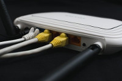

# docker-pi-safe-browse

A 'safe' proxy for home connections; A Rasperrby PI Home Browsing Privacy Distro (Dockerised)

How to use:
- Plug this into your router via the Ethernet port
- Disable the internal wifi on the router (Optional but recommended)
- Connect to this wireless receiver/network
### Very Optional
- buy one of these Long range rooftop wifi rc/tx [ttps://www.irishwireless.net/point-to-point-kits/small-business-ptp] and build a wireless metro network - route it out via free wifi spots or others. Needs adapter / h/w add on

# Features / Aspirations
- Internet Filtering/Protection
- IoT Device Anonymiser
- Fastest DNS finder
- VPN
- Personal Email Server (register your own domain)
- Metropolitan Area Peer to Peer Antennae support (A personal internet - route it out wherever you can/want. But your own
antennae)
- Virus Scan (maybe)

## Web Features
- Peer to Peer VPN Proxy - route your browsing through a network of trusted friends/servers
- SOCKS 5 Proxy via Tor
- SOCKS 5 Proxy via Random Server
- AdBlock
- Cache
- JS Blocker

## Usage Monitoring/Protection Features (Maybe for kids)
- Content Filter
- Browsing/Usage Reporting

